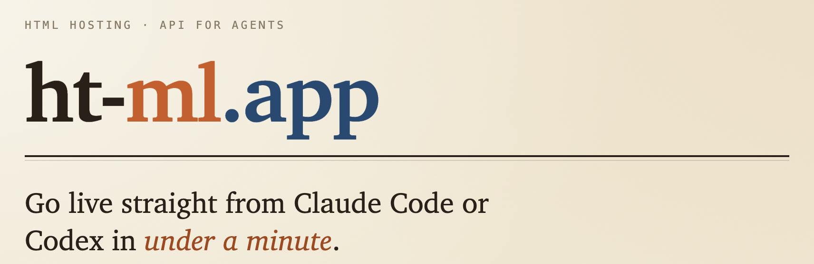

<p align="center">
  
</p>

# html — an Agent Skill for publishing HTML

A portable [Agent Skill](https://agentskills.io) that lets any compatible AI agent
publish a single-page HTML document to the public web in one request via
[ht-ml.app](https://ht-ml.app) — no accounts, no signup. It covers creating a
site, updating it, uploading referenced assets, optional password protection, and
ships **20 ready-made page templates** (slide decks, status reports, code reviews,
diagrams, dashboards, and more) for when the user has no HTML of their own.

The agent-facing instructions live in [`SKILL.md`](SKILL.md).

## Install

### Quick install (recommended)

One command installs the skill into the regular user-level skill locations for
**both Claude Code and Codex**:

```bash
curl -fsSL https://raw.githubusercontent.com/nsmith/html/main/install.sh | sh
```

This clones the skill to `~/.claude/skills/html` (Claude Code) and
`~/.agents/skills/html` (Codex). Re-run anytime to update. Prefer to review first?
It's [`install.sh`](install.sh). To install elsewhere (e.g. project-local), set
`SKILLS_DIR` or `DEST`:

```bash
curl -fsSL https://raw.githubusercontent.com/nsmith/html/main/install.sh | SKILLS_DIR=.claude/skills sh
```

### Alternative: the `skills` CLI

If you use the [`skills` CLI](https://skills.sh), it can install into every agent
it detects and gives you `skills update` / `skills remove`:

```bash
npx skills add nsmith/html        # project-level (./.claude/skills, ./.agents/skills, …)
npx skills add nsmith/html -g     # user-level (global)
```

### Alternative: Claude Code plugin

This repo also doubles as a single-plugin Claude Code marketplace (named `ht-ml`).
From inside Claude Code:

```text
/plugin marketplace add nsmith/html
/plugin install html@ht-ml
```

The plugin bundles the same skill, templates, and references.

### Manual install

A skill is just a folder containing `SKILL.md`; place it in your client's skills
directory **in a folder named `html`** (the folder name must match the skill's
`name`):

| Client | Clone into |
| :----- | :--------- |
| Claude Code (personal) | `~/.claude/skills/html` |
| Claude Code (project)  | `.claude/skills/html` |
| Codex (personal)       | `~/.agents/skills/html` |
| Codex / VS Code (project) | `.agents/skills/html` |

```bash
git clone https://github.com/nsmith/html.git ~/.claude/skills/html
```

After installing, restart your agent and run `/skills` to confirm `html` is
listed. Update later with `git pull` (or re-run the quick installer).

## What's inside

```
html/
├── SKILL.md              # Agent instructions (create / update / assets / password / templates)
├── references/api.md     # Full ht-ml.app API reference
├── scripts/publish.sh    # Helper: publish an HTML file → returns the public URL + update_key
├── assets/templates/     # 20 self-contained, single-file HTML templates + catalog
└── evals/                # Eval cases for measuring the skill (see Development)
```

The templates are fully self-contained (all CSS/JS/SVG inlined, no external
assets), so each publishes to ht-ml.app in a single request.

## Development

This repo uses [mise](https://mise.jdx.dev) + [uv](https://docs.astral.sh/uv/) for
its toolchain.

```bash
mise install          # provision Python + uv
mise run validate     # validate against the Agent Skills spec (skills-ref)
mise run install-cli  # install the skills-ref CLI onto your PATH
```

See [`evals/README.md`](evals/README.md) for the skill's evaluation setup.

## Links

- [ht-ml.app](https://ht-ml.app) — the hosting platform this skill targets
- [Agent Skills specification](https://agentskills.io/specification)

## License

MIT
